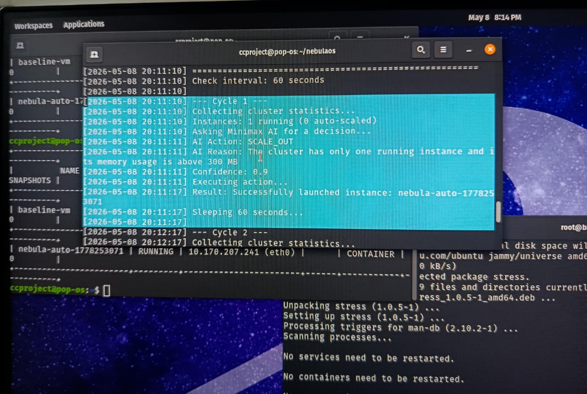
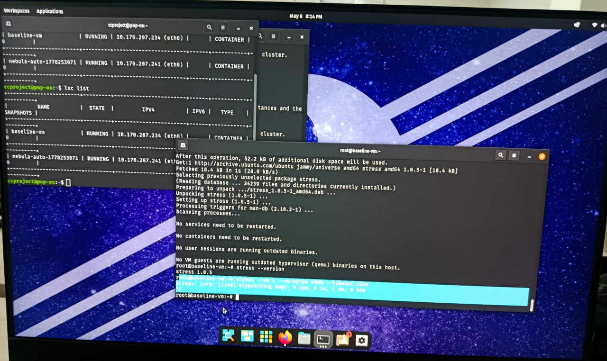

# NebulaOS

A private cloud built from scratch on a single Linux machine, managed by an AI-powered auto-scaling agent.

NebulaOS uses **LXD** as the cloud engine to create and manage containerised instances, and a **Python agent** backed by the **Groq API** to monitor the cluster and automatically scale instances up or down based on real-time resource usage. Every scaling decision comes with a plain-English explanation logged with a timestamp.

---

## What It Does

- Runs a fully functional private cloud on your local Linux machine using LXD
- Provides a web dashboard (LXD UI) to manage instances visually, similar to the AWS Console
- Monitors all running containers every 60 seconds for memory and CPU usage
- Sends live cluster statistics to an LLM via the Groq API for intelligent scaling decisions
- Automatically launches new containers when load is high (scale out)
- Automatically removes idle containers when load is low (scale in)
- Logs every decision with the AI's reasoning and a timestamp

---

## Demo


*Agent detecting high memory load and launching a new instance automatically*


*Two containers running after a successful scale-out event*


*Load simulation showing AI decisions across three different scenarios*

---

## Architecture

The project has two layers:

**Cloud Layer (LXD)**
- LXD manages containers using Linux kernel namespaces and cgroups
- Each container gets its own filesystem, process space, and network interface
- A virtual bridge (`lxdbr0`) provides private IP addresses to all containers
- LXD UI provides browser-based management and terminal access

**Agent Layer (Python)**

```
nebula_monitor.py   ->   nebula_brain.py   ->   nebula_action.py
  (collect stats)         (ask Groq AI)          (launch or delete)
         |                      |                        |
         +---------- nebula_agent.py (main loop) --------+
```

| Module | Role |
|---|---|
| `nebula_monitor.py` | Calls `lxc list` and returns structured cluster statistics |
| `nebula_brain.py` | Sends stats to Groq API, returns `scale_out`, `scale_in`, or `hold` |
| `nebula_action.py` | Executes the decision by launching or deleting LXD containers |
| `nebula_agent.py` | Main loop: runs monitor, brain, and action every 60 seconds |

---

## Tech Stack

| Technology | Purpose |
|---|---|
| [LXD](https://ubuntu.com/lxd) | Container and VM manager used as the cloud platform |
| [LXD UI](https://github.com/canonical/lxd-ui) | Web dashboard for visual cloud management |
| Python 3 | Agent language, uses only stdlib + `groq` package |
| [Groq API](https://console.groq.com) | Fast LLM inference for scaling decisions (Llama 3) |
| Pop OS / Ubuntu | Host operating system |
| `stress` | Load simulation tool installed inside containers |

---

## Requirements

- Linux machine running Ubuntu or any Ubuntu-based distro (Pop OS, Mint, etc.)
- `snap` package manager available
- Python 3.8 or higher
- A free Groq API key from [console.groq.com/keys](https://console.groq.com/keys)
- Internet connection for the first container image download (~400 MB, cached after that)

---

## Installation

### 1. Install and initialise LXD

```bash
sudo snap install lxd
sudo lxd init --auto
sudo usermod -aG lxd $USER
newgrp lxd
```

### 2. Verify LXD is working

```bash
lxc list
```

You should see an empty table with no errors.

### 3. Clone this repository

```bash
git clone https://github.com/yourusername/nebulaos.git
cd nebulaos
```

### 4. Install Python dependencies

```bash
pip3 install groq
```

### 5. Add your Groq API key

Open `nebula_brain.py` and replace the placeholder on line 5:

```python
GROQ_API_KEY = 'your-groq-api-key-here'
```

Get your key from [console.groq.com/keys](https://console.groq.com/keys). Free accounts have generous rate limits.

---

## Usage

### Launch a baseline container

```bash
lxc launch ubuntu:22.04 baseline-vm
lxc list
```

Wait for the status to show `RUNNING`.

### Start the agent

```bash
python3 nebula_agent.py
```

The agent will print a log entry every 60 seconds showing what it collected, what the AI decided, and what action was taken.

### Watch the log in a second terminal

```bash
tail -f nebula_agent.log
```

### Run the load simulation

```bash
python3 simulate_load.py
```

This feeds three different load scenarios to the AI (high load, low load, stable load) and prints the decisions. Useful for demos and testing without waiting for real load.

### Simulate real load inside a container

```bash
lxc exec baseline-vm -- bash
apt install stress -y
stress --vm 1 --vm-bytes 400M --timeout 180s
```

This pushes memory usage above the 300 MB threshold and triggers a real scale-out event. Watch the agent log to see it respond.

---

## Project Structure

```
nebulaos/
├── nebula_monitor.py    # Collects LXD cluster statistics
├── nebula_brain.py      # Groq AI decision engine
├── nebula_action.py     # Launches or terminates containers
├── nebula_agent.py      # Main agent loop
├── simulate_load.py     # Load simulation script for testing
├── test_lxd.py          # Quick LXD connection test
├── nebula_agent.log     # Auto-generated decision log
└── README.md
```

---

## How the AI Decision Works

Each cycle, the agent sends a JSON payload like this to the Groq API:

```json
{
  "timestamp": "2026-05-08 20:11:10",
  "total_instances": 1,
  "running_instances": 1,
  "auto_scaled_instances": 0,
  "instance_details": [
    {
      "name": "baseline-vm",
      "status": "Running",
      "memory_mb": 420.5,
      "cpu_usage_ns": 9800000000
    }
  ]
}
```

The model responds with:

```json
{
  "action": "scale_out",
  "reason": "The cluster has only one running instance and its memory usage is above 300 MB.",
  "confidence": 0.9
}
```

The agent then executes `lxc launch ubuntu:22.04 nebula-auto-<timestamp>` and logs the result.

---

## Configuration

All scaling limits are set at the top of `nebula_action.py`:

```python
MIN_INSTANCES = 1    # Never go below this
MAX_INSTANCES = 3    # Never go above this
BASE_IMAGE = 'ubuntu:22.04'
```

The check interval is set at the top of `nebula_agent.py`:

```python
CHECK_INTERVAL = 60  # seconds
```

---

## Useful LXD Commands

```bash
lxc list                          # List all instances
lxc launch ubuntu:22.04 myvm      # Create and start a container
lxc exec myvm -- bash             # Open a shell inside a container
lxc info myvm                     # Show resource stats for one instance
lxc stop myvm                     # Stop a container
lxc delete myvm --force           # Force delete a running container
lxc image list                    # Show locally cached images
```

---

## Troubleshooting

| Problem | Fix |
|---|---|
| `lxc: command not found` | Run `sudo snap install lxd` |
| Permission denied on `lxc` commands | Run `newgrp lxd` in the current terminal |
| First container launch is slow | Normal. Ubuntu image is downloading once (~400 MB). Subsequent launches are fast. |
| `ModuleNotFoundError: groq` | Run `pip3 install groq` |
| Groq API key error | Check that your key is correctly pasted in `nebula_brain.py` |
| `json.JSONDecodeError` from brain module | Retry. Rare and self-resolving. |
| Agent launched too many instances | Check `MAX_INSTANCES` in `nebula_action.py` |

---

## License

MIT License. Feel free to use, modify, and distribute.
